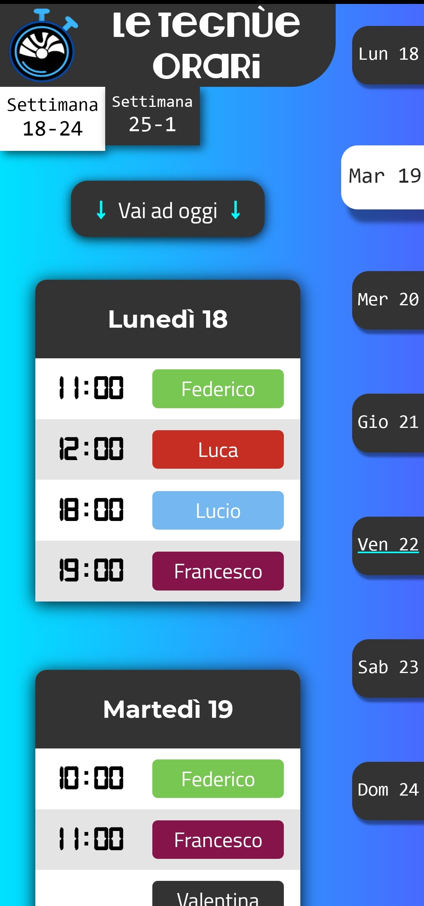
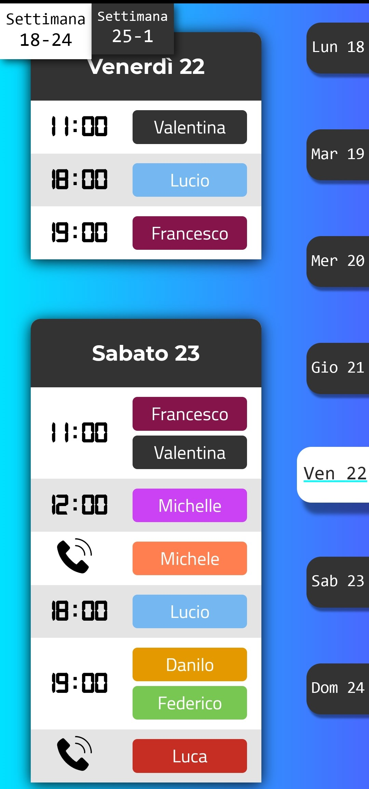
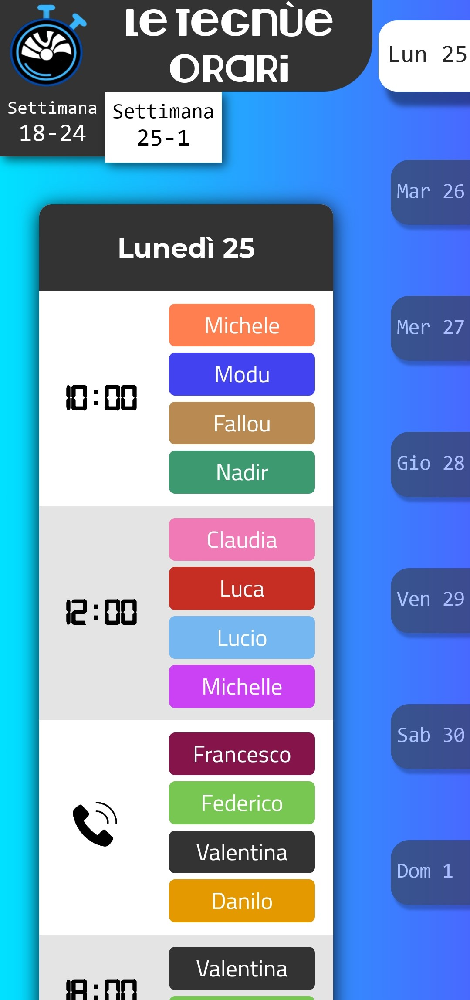

 

# Le Tegnùe Orari 
Le Tegnùe Orari is a webapp showing work shift of "Le Tegnùe Beach Restaurant" staff.

The page is designed mainly for mobile devices.

**Link: <a href="https://orari-dd568.web.app/"> https://orari-dd568.web.app/ </a>**

 

## Technologies
This site was built using:
-  [React](https://reactjs.org/).
-  [Firebase](https://firebase.google.com/):
  - [Firebase Realtime Database](https://firebase.google.com/docs/database) for back-end and JSON database.
  - [Firebase Hosting](https://firebase.google.com/docs/hosting) for hosting service.

 
## Screenshots

 &ensp;&ensp;&ensp;&ensp;  &ensp;&ensp;&ensp;&ensp; 

